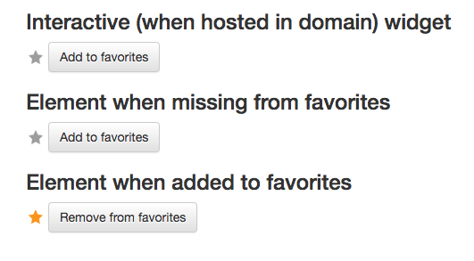

# jQuery Favorite Widget
Provides an stateful widget for adding or removing selected content from
favorites that are stored in cookies.

# Screenshot



# Usage

## Basic usage

```
$('.fav').favoriteWidget({id: 'http://www.example.com/articleX'});
```

Given we have ``<div class="fav"></div>`` and given content isn't in favorites,
following initialization would become:
```
<div class="fav favoritewidget favoritewidget--addfav"><button>Add to favorites</button></div>
```

When clicking "Add to favorites" the element class would change to
"favoritewidget--delfav":
```
<div class="fav favoritewidget favoritewidget--delfav"><button>Remove favorites</button></div>
```

## Options
```
$('.fav').favoriteWidget({
  id: 'http://www.example.com/articleX',
  cookieName: 'favoritewidget',
  cookieOptions: {
    expires: 365,
    path: '/'
  },
  addToFavLabel: 'Add to favorites',
  delFromFavLabel: 'Remove from favorites',
  wrapperClassName: 'favoritewidget',
  addClassName: 'favoritewidget--addfav',
  delClassName: 'favoritewidget--delfav',
  inlineElement: 'button',
  inlineElementClassName: true
});
```

# License
This project is dual licensed with [MIT or GPL v3](LICENSE).
